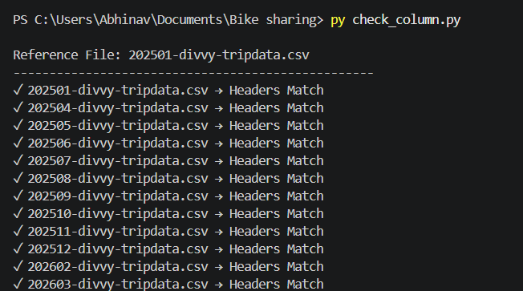

# Cyclistic-bike-share-analysis
## Ask
### Business Problem
The objective of this analysis is to understand how annual members and casual riders use Cyclistic bike-share services differently. The insights will help the marketing team design strategies to convert casual riders into annual members and increase overall profitability.
### Key Business Question
How do annual members and casual riders use Cyclistic bikes differently?     
This question will be answered in the analysis phase using the dataset.
### Stakeholders
- Cyclistic Executive Team
- Lily Moreno (Director of Marketing)
- Marketing Analytics Team
### Business Goal
The goal is to identify behavioral differences between casual riders and annual members in order to support targeted marketing strategies that encourage membership conversions.
### Approach
This analysis will follow a structured data analysis process (Ask, Prepare, Process, Analyze, Share, Act) to ensure insights are accurate and actionable.
## Prepare
The dataset used for this analysis was obtained from the public Cyclistic bike-share trip data source provided by Divvy. It contains historical trip data for the last 12 months in CSV format. Each monthly file represents trip data for a specific month.

[View the Dataset Here](https://divvy-tripdata.s3.amazonaws.com/index.html)

Each row in the dataset represents one individual bike trip taken by a user.
### Data Credibility (ROCCC)
The dataset was evaluated using the ROCCC framework:

- Reliable – Data is collected directly from the bike-share system
- Original – First-party source data from the official provider
- Comprehensive – Includes complete trip-level records
- Current – Covers the most recent 12-month period
- Cited – Publicly available through the official data source
### Data Privacy and Licensing
The dataset is publicly available and does not contain personally identifiable information (PII). No customer names, addresses, payment details, or contact information are included, ensuring privacy and security. The data is shared for public analytical use under the provider’s licensing terms.
### Data Integrity Verification
To verify the consistency of the dataset structure, a Python script (`check_column.py`) was created using pandas.

The script:
- Scanned all 12 monthly CSV files
- Read only the header row of each file
- Compared all column names using the first file as the reference

### Validation Output
The Python script successfully checked all 12 monthly CSV files and confirmed that each file contains the same 13 column headers.

No missing columns or extra columns were found in any file.

This ensures that the dataset structure is consistent across the entire 12-month period.

