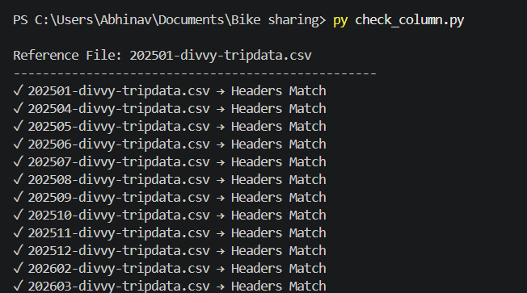
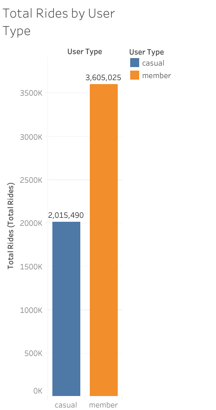
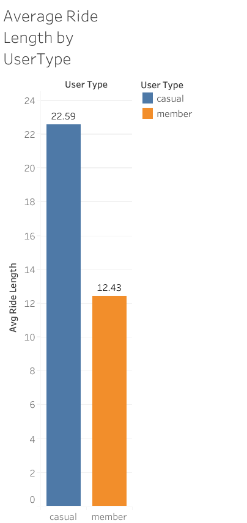
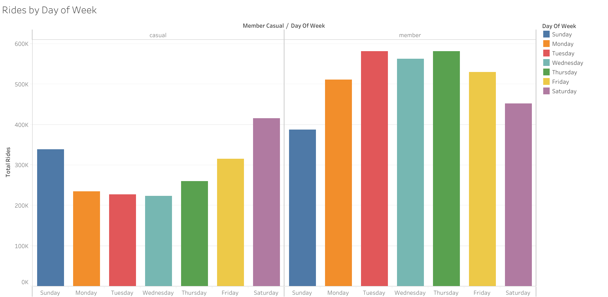
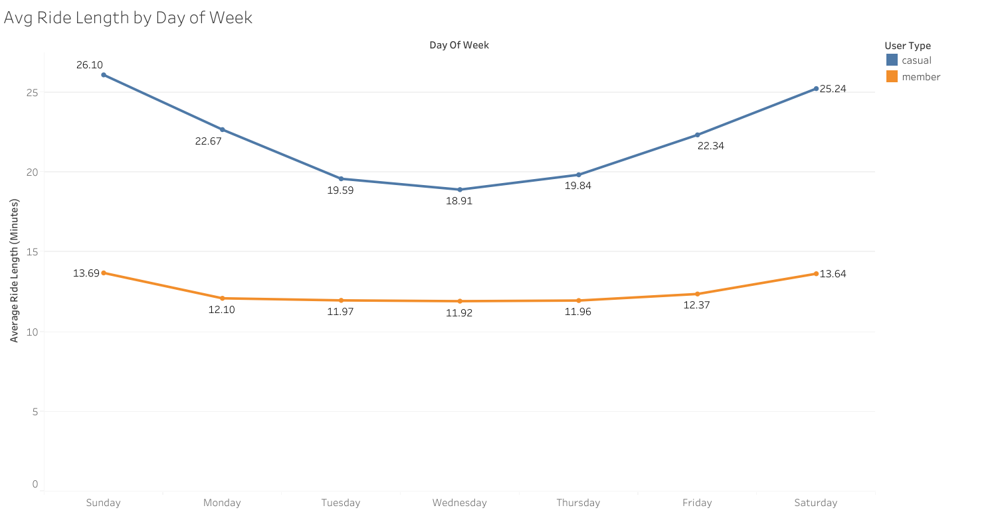
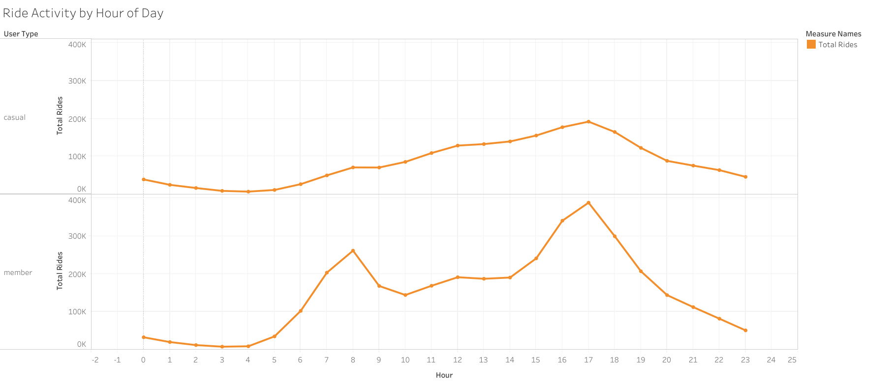
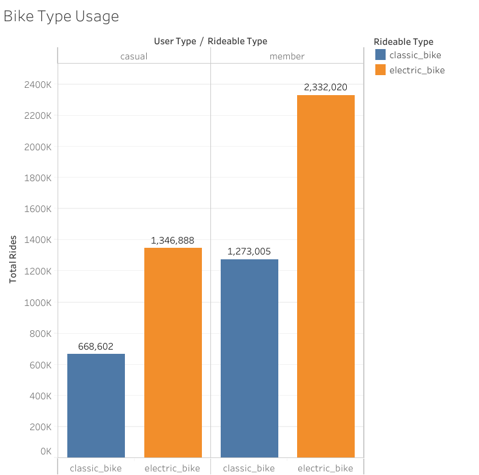

# Cyclistic-bike-share-analysis
## Ask
### Business Problem
The objective of this analysis is to understand how annual members and casual riders use Cyclistic bike-share services differently. The insights will help the marketing team design strategies to convert casual riders into annual members and increase overall profitability.
### Key Business Question
How do annual members and casual riders use Cyclistic bikes differently?     
This question will be answered in the analysis phase using the dataset.
### Stakeholders
- Cyclistic Executive Team
- Lily Moreno (Director of Marketing)
- Marketing Analytics Team
### Business Goal
The goal is to identify behavioral differences between casual riders and annual members in order to support targeted marketing strategies that encourage membership conversions.
### Approach
This analysis will follow a structured data analysis process (Ask, Prepare, Process, Analyze, Share, Act) to ensure insights are accurate and actionable.
## Prepare
The dataset used for this analysis was obtained from the public Cyclistic bike-share trip data source provided by Divvy.The datasets have been publicly available by Motivate International Inc. under this [license](https://divvybikes.com/data-license-agreement). It contains historical trip data for the last 12 months in CSV format. Each monthly file represents trip data for a specific month.

[View the Dataset Here](https://divvy-tripdata.s3.amazonaws.com/index.html)

Each row in the dataset represents one individual bike trip taken by a user.
### Data Credibility (ROCCC)
The dataset was evaluated using the ROCCC framework:

- Reliable – Data is collected directly from the bike-share system
- Original – First-party source data from the official provider
- Comprehensive – Includes complete trip-level records
- Current – Covers the most recent 12-month period
- Cited – Publicly available through the official data source
### Data Privacy and Licensing
The dataset is publicly available and does not contain personally identifiable information (PII). No customer names, addresses, payment details, or contact information are included, ensuring privacy and security. The data is shared for public analytical use under the provider’s licensing terms.
### Data Integrity Verification
To verify the consistency of the dataset structure, a Python script (`check_column.py`) was created using pandas.

The script:
- Scanned all 12 monthly CSV files
- Read only the header row of each file
- Compared all column names using the first file as the reference

### Validation Output
The Python script successfully checked all 12 monthly CSV files and confirmed that each file contains the same 13 column headers.

No missing columns or extra columns were found in any file.

This ensures that the dataset structure is consistent across the entire 12-month period.

## Process

The dataset contained 12 monthly Cyclistic trip CSV files. Each file was imported into SQLite using DB Browser for SQLite and checked for column consistency before combining.

### Cleaning Steps

- Verified that matching columns across all tables had consistent data types
- Combined all 12 monthly tables into one master table called `all_trips`
- Checked for duplicate `ride_id` values (none found)
- Checked for NULL values in `started_at` and `ended_at` (none found)
- Identified and removed 29 invalid rides with zero or negative ride duration
- Created a `ride_length` column using `julianday()` to calculate trip duration in minutes
- Created a `day_of_week` column using `strftime()` to identify ride start weekdays
- Verified that there were no invalid rides where `started_at = ended_at`

## Analyze & Share

### Total Rides by User Type

Annual members account for a higher number of total rides compared to casual riders, indicating more frequent usage.

### Average Ride Length by User Type

Casual riders have a higher average ride duration than annual members, suggesting that casual users primarily use bikes for leisure and recreational purposes, while members use them for shorter routine trips.

### Rides by Day of Week

Annual members show higher ride activity during weekdays, indicating commuting behavior, while casual riders show increased usage on weekends, suggesting recreational usage patterns.

### Average Ride Length by Day of Week

Casual riders show significantly longer average ride durations during weekends, while annual members maintain relatively stable ride durations throughout the week, indicating routine commuting behavior.

### Ride Activity by Hour of Day

Annual members show strong ride activity during commuting hours, particularly around 8 AM and 5–6 PM, indicating work-related usage patterns. Casual riders display more evenly distributed ride activity throughout the day, suggesting leisure and recreational usage.

### Bike Type Usage

Electric bikes were the most preferred bike type among both casual riders and annual members. Annual members recorded the highest overall usage, particularly for electric bikes, indicating strong adoption for routine commuting and convenience. Casual riders also showed significantly higher usage of electric bikes compared to classic bikes, suggesting a preference for easier and more flexible recreational rides.

### [Explore the interactive Tableau dashboard here.](https://public.tableau.com/app/profile/abhinav.chopra6308/viz/BikeSharingCharts/AvgRideLengthbyDayofWeek)

## Act

Based on the analysis, the following recommendations are suggested to help convert casual riders into annual members.

### 1. Launch Weekend-Focused Membership Promotions

Casual riders showed higher ride activity and longer ride durations during weekends, indicating that they primarily use bikes for leisure and recreational purposes. Cyclistic can introduce weekend-only membership discounts, free trial memberships, or bundled weekend ride offers to encourage casual riders to transition into annual memberships.

### 2. Promote Electric Bike Membership Benefits

Electric bikes were the most preferred bike type among both casual riders and annual members. Cyclistic can highlight the convenience, comfort, and accessibility of electric bikes through targeted marketing campaigns and member-exclusive electric bike benefits to attract casual riders toward membership plans.

### 3. Introduce Commuter-Oriented Incentives

Annual members showed strong weekday and commuting-hour ride patterns, while some casual riders also demonstrated regular usage behavior. Cyclistic can offer commuter-focused incentives such as discounted monthly memberships, ride credits, or loyalty rewards to encourage frequent casual riders to become annual members.